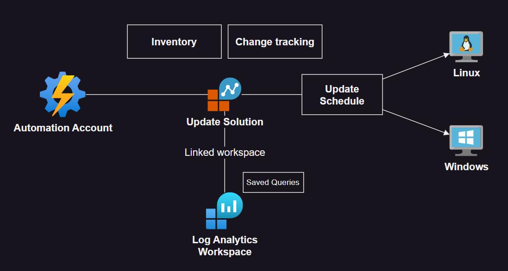

# Azure Automation Accounts

Patching and automation operations on Azure with Automation Accounts.

> ℹ️ New patching should be done with Update Manager



Set the `.auto.tfvars` file:

```sh
cp config/template.tfvars .auto.tfvars
```

Create the infrastructure:

```sh
terraform init
terraform apply -auto-approve
```

After this, enable the update for the VMs from the automation account.

> 👉 Since Automation [does not support][1] Ubuntu 22, I'm running this with 20.04.

Once configured and executed, patching should be fixed on all machines:


Inventory and change tracking are also enabled via Terraform:


[1]: https://learn.microsoft.com/en-us/azure/automation/update-management/operating-system-requirements?tabs=os-linux%2Csr-win#supported-operating-systems
